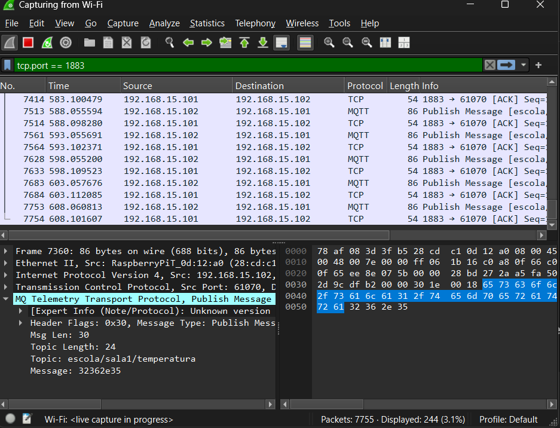
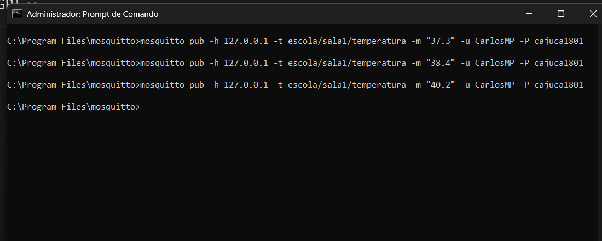
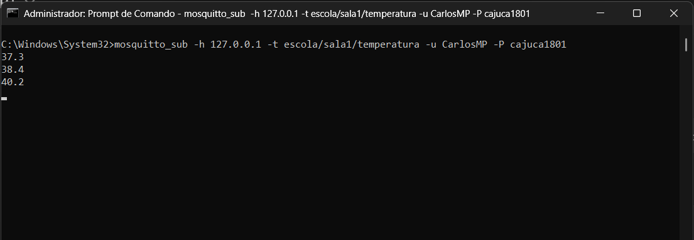
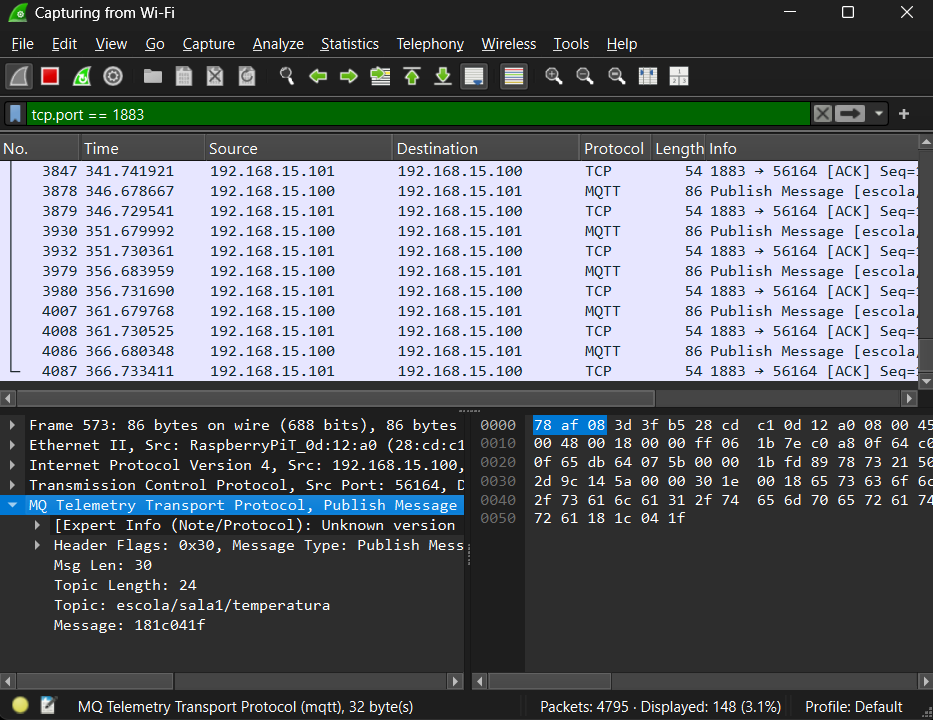
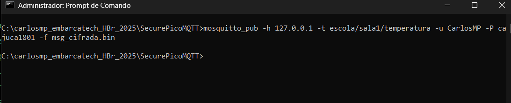
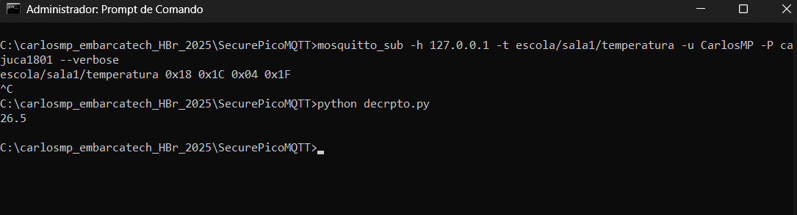

# SecurePicoMQTT - Segurança em IoT com BitDogLab

## O que é MQTT?
MQTT (Message Queuing Telemetry Transport) é um protocolo de comunicação leve e eficiente, projetado para conectar dispositivos em redes com pouca largura de banda, latência alta ou conectividade intermitente — exatamente o tipo de ambiente encontrado em aplicações de Internet das Coisas (IoT).

O MQTT segue o modelo publish/subscribe (publicação/assinatura), no qual os dispositivos podem atuar como:

Publicadores (publishers): enviam mensagens sobre determinado tópico (ex: "sensor/temperatura").

Subscritores (subscribers): recebem as mensagens dos tópicos que assinaram.

Esse modelo desacopla os emissores e receptores — ou seja, eles não precisam conhecer a existência um do outro, o que facilita muito a escalabilidade e flexibilidade de sistemas IoT com dezenas ou centenas de dispositivos distribuídos.

## O que é um broker MQTT?
O broker é o servidor que faz o papel de intermediário: ele recebe mensagens dos publicadores e distribui para todos os subscritores interessados. Ele garante a entrega correta, eficiente e (em níveis mais avançados) confiável das mensagens.

## O que é o Mosquitto?
Mosquitto é uma implementação leve e de código aberto de um broker MQTT. Ele é amplamente usado em projetos de IoT por sua facilidade de uso, suporte a autenticação, criptografia e compatibilidade com diversas plataformas, incluindo sistemas embarcados como o Raspberry Pi Pico W.

## Descrição das etapas do projeto:

Etapa 1: arquivos SecurePicoMQRR.c, wifi_conn.c, wifi_conn.h e CMakeLists.txt para fazer uma conexão simples com a rede wifi local.

SecurePicoMQTT.c:
#include "include/wifi_conn.h"
#include "pico/stdlib.h"
#include <stdio.h>

int main() {
    // Inicializa a biblioteca padrão do Pico (necessária para GPIO, UART, etc.)
    stdio_init_all();
    sleep_ms(5000); // Tempo para abrir o monitor serial

    // Credenciais da rede Wi-Fi (substitua pelos valores reais)
    const char *ssid = "monha-rede-wifi";
    const char *password = "minha-senha-rede-wifi";

    // Chama a função para conectar ao Wi-Fi
    connect_to_wifi(ssid, password);

    // Loop principal para manter o programa em execução
    while (true) {
        // Adicione aqui futuras funcionalidades (ex.: MQTT, autenticação, criptografia)
        sleep_ms(1000); // Aguarda 1 segundo para evitar consumo excessivo de CPU
    }

    return 0;
}

wifi_conn.c:
#include "include/wifi_conn.h"         // Cabeçalho com a declaração da função de conexão Wi-Fi
#include "pico/cyw43_arch.h"           // Biblioteca para controle do chip Wi-Fi CYW43 no Raspberry Pi Pico W
#include <stdio.h>                     // Biblioteca padrão de entrada/saída (para usar printf)

/**
 * Função: connect_to_wifi
 * Objetivo: Inicializar o chip Wi-Fi da Pico W e conectar a uma rede usando SSID e senha fornecidos.
 */
void connect_to_wifi(const char *ssid, const char *password) {
    // Inicializa o driver Wi-Fi (CYW43). Retorna 0 se for bem-sucedido.
    if (cyw43_arch_init()) {
        printf("Erro ao iniciar Wi-Fi\n");
        return;
    }

    // Habilita o modo estação (STA) para se conectar a um ponto de acesso.
    cyw43_arch_enable_sta_mode();

    // Tenta conectar à rede Wi-Fi com um tempo limite de 30 segundos (30000 ms).
    // Utiliza autenticação WPA2 com criptografia AES.
    if (cyw43_arch_wifi_connect_timeout_ms(ssid, password, CYW43_AUTH_WPA2_AES_PSK, 30000)) {
        printf("Erro ao conectar\n");  // Se falhar, imprime mensagem de erro.
    } else {        
        printf("Conectado ao Wi-Fi\n");  // Se conectar com sucesso, exibe confirmação.
    }
}

wifi_conn.h:
#ifndef WIFI_CONN_H
#define WIFI_CONN_H

/**
 * Função: connect_to_wifi
 * Objetivo: Conectar o Raspberry Pi Pico W a uma rede Wi-Fi usando SSID e senha fornecidos.
 * Parâmetros:
 *   - ssid: Nome da rede Wi-Fi
 *   - password: Senha da rede Wi-Fi
 */
void connect_to_wifi(const char *ssid, const char *password);

#endif // WIFI_CONN_H

CMakeLists.txt:
# Generated Cmake Pico project file

cmake_minimum_required(VERSION 3.13)

set(CMAKE_C_STANDARD 11)
set(CMAKE_CXX_STANDARD 17)
set(CMAKE_EXPORT_COMPILE_COMMANDS ON)

# Initialise pico_sdk from installed location
# (note this can come from environment, CMake cache etc)

# == DO NOT EDIT THE FOLLOWING LINES for the Raspberry Pi Pico VS Code Extension to work ==
if(WIN32)
    set(USERHOME $ENV{USERPROFILE})
else()
    set(USERHOME $ENV{HOME})
endif()
set(sdkVersion 2.1.1)
set(toolchainVersion 14_2_Rel1)
set(picotoolVersion 2.1.1)
set(picoVscode ${USERHOME}/.pico-sdk/cmake/pico-vscode.cmake)
if (EXISTS ${picoVscode})
    include(${picoVscode})
endif()
# ====================================================================================
set(PICO_BOARD pico_w CACHE STRING "Board type")

# Pull in Raspberry Pi Pico SDK (must be before project)
include(pico_sdk_import.cmake)

project(SecurePicoMQTT C CXX ASM)

# Initialise the Raspberry Pi Pico SDK
pico_sdk_init()

# Add executable. Default name is the project name, version 0.1

add_executable(SecurePicoMQTT SecurePicoMQTT.c wifi_conn.c)

pico_set_program_name(SecurePicoMQTT "SecurePicoMQTT")
pico_set_program_version(SecurePicoMQTT "0.1")

# Modify the below lines to enable/disable output over UART/USB
pico_enable_stdio_uart(SecurePicoMQTT 0)
pico_enable_stdio_usb(SecurePicoMQTT 1)

# Add the standard library to the build
target_link_libraries(SecurePicoMQTT
        pico_stdlib)

# Add the standard include files to the build
target_include_directories(SecurePicoMQTT PRIVATE
        ${CMAKE_CURRENT_LIST_DIR}
)

# Add any user requested libraries
target_link_libraries(SecurePicoMQTT 
        pico_cyw43_arch_lwip_threadsafe_background
        )

pico_add_extra_outputs(SecurePicoMQTT)

Saída do  Monitor Serial:
---- Opened the serial port COM4 ----
Conectado ao Wi-Fi

Etapa 2: arquivos SecurePicoMQTT.c, CMakeLists.txt e lwipopts.h modificados e mqtt_comm.c e mqtt_comm.h adicionados para testar a conexão MQTT básica do Raspberry Pi Pico W com o broker Mosquitto, verificando se o dispositivo se conecta ao Wi-Fi, estabelece uma conexão com o broker, e publica mensagens no tópico test/topic, usando o Mosquitto para monitoramento e o Wireshark para análise de tráfego.


````markdown
# 🚀 Projeto: Comunicação MQTT Segura com BitDogLab (RP2040 Pico W)

Este projeto demonstra a conexão segura entre a placa **BitDogLab baseada no RP2040 Pico W** e um **broker MQTT (Mosquitto)**, utilizando C/C++ com o SDK do Pico e a stack lwIP.

---

## ✅ Etapas Realizadas

1. Conexão Wi-Fi com autenticação WPA2.
2. Conexão MQTT com autenticação no Mosquitto.
3. Publicação periódica de mensagens no tópico `test/topic`.
4. Diagnóstico de problemas de rede com Wireshark.
5. Solução aplicada via configuração de firewall.

---

## 🧪 Problema Encontrado

Durante os testes, foi observado que a comunicação MQTT **só funcionava se o Wireshark estivesse em execução**.

### Sintomas:

- No monitor serial da Pico W:
  ```text
  Aguardando conexão MQTT...
  Falha ao conectar ao broker MQTT. Abortando.
````

* No terminal do Mosquitto: nenhuma conexão ou publicação aparecia.
* Com o Wireshark ativo: tudo funcionava perfeitamente.

---

## 🕵️ Diagnóstico

* O **Wireshark ativa o modo promíscuo** na interface de rede.
* Isso força o sistema a **escutar pacotes que normalmente seriam descartados** pelo firewall do Windows.
* A biblioteca **lwIP** (usada na Pico W) depende de respostas explícitas (ex: SYN/ACK ou RST). Se o firewall **silenciosamente descartar pacotes**, o `mqtt_client_connect()` nunca completa com sucesso.

---

## 🔧 Solução Aplicada

Foi criada uma **regra de entrada no Firewall do Windows** para **permitir conexões TCP na porta 1883**, usada pelo Mosquitto.

### Passos:

1. Acesse: `Firewall do Windows Defender > Configurações Avançadas`.
2. Selecione **"Regras de Entrada"** > **"Nova Regra..."**.
3. Tipo: **Porta**
4. Protocolo: **TCP**
5. Porta: **1883**
6. Ação: **Permitir a conexão**
7. Perfis: **Domínio**, **Privado**, **Público**
8. Nome: `Mosquitto 1883 Allow`

---

## 📡 Resultado

Após aplicar a regra:

* ✅ A Pico W conecta ao Wi-Fi
* ✅ A conexão MQTT é estabelecida
* ✅ O broker Mosquitto recebe publicações da placa

Exemplo do log do Mosquitto:

```
New client connected from 192.168.15.102 as pico_client
Received PUBLISH from pico_client on topic test/topic
```

---

## 🧠 Lições Aprendidas

* **Stacks embarcadas (como lwIP) são sensíveis a firewalls que descartam pacotes silenciosamente.**
* O **Wireshark pode temporariamente “resolver” o problema**, mascarando a causa real.
* É fundamental **testar o ambiente de rede real** onde o sistema embarcado será usado.
* **Firewall do Windows pode interferir mesmo com o Mosquitto rodando localmente.**

---

## 📂 Estrutura do Projeto

```
SecurePicoMQTT/
├── CMakeLists.txt
├── SecurePicoMQTT.c
├── mqtt_comm.c/h
├── wifi_conn.c/h
├── lwipopts.h
└── README.md  <-- Este arquivo
```

---

## 📚 Referências

* [lwIP MQTT Docs](https://www.nongnu.org/lwip/)
* [Mosquitto](https://mosquitto.org/)
* [Pico SDK Network Examples](https://www.raspberrypi.com/documentation/pico-sdk/networking.html)

---

## 🔒 Próximos Passos

* Implementar **criptografia leve com XOR** nas mensagens.
* Proteger contra **ataques de replay** com timestamp.
* Opcional: usar **AES ou HMAC** para autenticação e integridade.

---

“Se estiver usando Windows, mantenha o Wireshark aberto para garantir que o firewall/driver de rede permita tráfego MQTT na porta 1883.”

## 🧪 Testes de Conectividade no Windows

Durante o desenvolvimento, foi observado que o cliente MQTT da Pico W (usando lwIP) **só conseguia conectar ao broker Mosquitto no Windows se o Wireshark estivesse em execução**.

### Testes realizados:

- ✅ `mosquitto_sub` e `mosquitto_pub` funcionam localmente com autenticação.
- ❌ `netsh advfirewall set allprofiles state off` **não resolveu** (firewall supostamente desativado).
- ❌ `netsh advfirewall firewall add rule name="Mosquitto MQTT" dir=in action=allow protocol=TCP localport=1883` **não liberou as conexões da Pico W**.
- ✅ Ao **abrir o Wireshark com filtro `tcp.port == 1883`**, a conexão MQTT passou a funcionar imediatamente e com estabilidade.

### Conclusão:

O Windows pode bloquear pacotes silenciosamente em nível baixo (WFP, driver ou antivírus), mesmo com o firewall aparentemente desativado ou com regras explícitas. O Wireshark, ao ativar o modo promíscuo, força a rede a escutar pacotes externos — o que acaba desbloqueando a comunicação com a Pico W.

> 💡 **Solução temporária**: mantenha o Wireshark em execução durante os testes no Windows.
>  
> 🔄 **Soluções definitivas**: utilizar Linux, rodar o broker em outro dispositivo (como Raspberry Pi), ou migrar para TLS (porta 8883) com uma stack MQTT que suporte `mbedTLS`.


SecurePicoMQTT.c:
#include "include/wifi_conn.h"
#include "include/mqtt_comm.h"
#include "pico/stdlib.h"
#include <stdio.h>
#include <string.h>

int main() {
    // Inicializa a biblioteca padrão do Pico (necessária para GPIO, UART, etc.)
    stdio_init_all();
    
    // Aguarda inicialização do USB para depuração (opcional, dá tempo para o console conectar)
    sleep_ms(5000);

    // Credenciais da rede Wi-Fi (substitua pelos valores reais)
    const char *ssid = "VIVOFIBRA-8991_EXT";
    const char *password = "cajuca1801";

    // Conectar ao Wi-Fi
    connect_to_wifi(ssid, password);

    // Aguarda a conexão Wi-Fi estabilizar
    sleep_ms(2000);

    // Configurações do broker MQTT
    const char *client_id = "pico_client";
    const char *broker_ip = "127.0.0.1"; // Substitua pelo IP do broker (localhost para testes locais)
    const char *user = "CarlosMP";      // Substitua pelo usuário configurado no Mosquitto
    const char *pass = "cajuca1801";      // Substitua pela senha configurada no Mosquitto

    // Configura e conecta ao broker MQTT
    mqtt_setup(client_id, broker_ip, user, pass);

    // Aguarda a conexão MQTT (dá tempo para o callback confirmar)
    sleep_ms(2000);

    // Loop principal para publicar mensagens de teste
    while (true) {
        // Mensagem de teste
        const char *message = "Hello, MQTT!";
        const char *topic = "test/topic";
        
        // Publica a mensagem no tópico
        mqtt_comm_publish(topic, (const uint8_t *)message, strlen(message));

        // Aguarda 5 segundos antes de publicar novamente
        sleep_ms(5000);
    }

    return 0;
}

mqtt_comm.c:
#include "lwip/apps/mqtt.h"       // Biblioteca MQTT do lwIP
#include "include/mqtt_comm.h"    // Header file com as declarações locais
// Base: https://github.com/BitDogLab/BitDogLab-C/blob/main/wifi_button_and_led/lwipopts.h
#include "lwipopts.h"             // Configurações customizadas do lwIP

/* Variável global estática para armazenar a instância do cliente MQTT
 * 'static' limita o escopo deste arquivo */
static mqtt_client_t *client;

/* Callback de conexão MQTT - chamado quando o status da conexão muda
 * Parâmetros:
 *   - client: instância do cliente MQTT
 *   - arg: argumento opcional (não usado aqui)
 *   - status: resultado da tentativa de conexão */
static void mqtt_connection_cb(mqtt_client_t *client, void *arg, mqtt_connection_status_t status) {
    if (status == MQTT_CONNECT_ACCEPTED) {
        printf("Conectado ao broker MQTT com sucesso!\n");
    } else {
        printf("Falha ao conectar ao broker, código: %d\n", status);
    }
}

/* Função para configurar e iniciar a conexão MQTT
 * Parâmetros:
 *   - client_id: identificador único para este cliente
 *   - broker_ip: endereço IP do broker como string (ex: "192.168.1.1")
 *   - user: nome de usuário para autenticação (pode ser NULL)
 *   - pass: senha para autenticação (pode ser NULL) */
void mqtt_setup(const char *client_id, const char *broker_ip, const char *user, const char *pass) {
    ip_addr_t broker_addr;  // Estrutura para armazenar o IP do broker
    
    // Converte o IP de string para formato numérico
    if (!ip4addr_aton(broker_ip, &broker_addr)) {
        printf("Erro no IP\n");
        return;
    }

    // Cria uma nova instância do cliente MQTT
    client = mqtt_client_new();
    if (client == NULL) {
        printf("Falha ao criar o cliente MQTT\n");
        return;
    }

    // Configura as informações de conexão do cliente
    struct mqtt_connect_client_info_t ci = {
        .client_id = client_id,  // ID do cliente
        .client_user = user,     // Usuário (opcional)
        .client_pass = pass      // Senha (opcional)
    };

    // Inicia a conexão com o broker
    // Parâmetros:
    //   - client: instância do cliente
    //   - &broker_addr: endereço do broker
    //   - 1883: porta padrão MQTT
    //   - mqtt_connection_cb: callback de status
    //   - NULL: argumento opcional para o callback
    //   - &ci: informações de conexão
    mqtt_client_connect(client, &broker_addr, 1883, mqtt_connection_cb, NULL, &ci);
}

/* Callback de confirmação de publicação
 * Chamado quando o broker confirma recebimento da mensagem (para QoS > 0)
 * Parâmetros:
 *   - arg: argumento opcional
 *   - result: código de resultado da operação */
static void mqtt_pub_request_cb(void *arg, err_t result) {
    if (result == ERR_OK) {
        printf("Publicação MQTT enviada com sucesso!\n");
    } else {
        printf("Erro ao publicar via MQTT: %d\n", result);
    }
}

/* Função para publicar dados em um tópico MQTT
 * Parâmetros:
 *   - topic: nome do tópico (ex: "sensor/temperatura")
 *   - data: payload da mensagem (bytes)
 *   - len: tamanho do payload */
void mqtt_comm_publish(const char *topic, const uint8_t *data, size_t len) {
    // Envia a mensagem MQTT
    err_t status = mqtt_publish(
        client,              // Instância do cliente
        topic,               // Tópico de publicação
        data,                // Dados a serem enviados
        len,                 // Tamanho dos dados
        0,                   // QoS 0 (nenhuma confirmação)
        0,                   // Não reter mensagem
        mqtt_pub_request_cb, // Callback de confirmação
        NULL                 // Argumento para o callback
    );

    if (status != ERR_OK) {
        printf("mqtt_publish falhou ao ser enviada: %d\n", status);
    }
}


mqtt_comm.h:
#ifndef MQTT_COMM_H
#define MQTT_COMM_H

#include "lwip/apps/mqtt.h"

/**
 * Função: mqtt_setup
 * Objetivo: Configurar e iniciar a conexão com o broker MQTT.
 * Parâmetros:
 *   - client_id: Identificador único do cliente
 *   - broker_ip: Endereço IP do broker (ex.: "192.168.1.1")
 *   - user: Nome de usuário para autenticação (pode ser NULL)
 *   - pass: Senha para autenticação (pode ser NULL)
 */
void mqtt_setup(const char *client_id, const char *broker_ip, const char *user, const char *pass);

/**
 * Função: mqtt_comm_publish
 * Objetivo: Publicar dados em um tópico MQTT.
 * Parâmetros:
 *   - topic: Nome do tópico (ex.: "sensor/temperatura")
 *   - data: Payload da mensagem (bytes)
 *   - len: Tamanho do payload
 */
void mqtt_comm_publish(const char *topic, const uint8_t *data, size_t len);

#endif // MQTT_COMM_H


CMakeLists.txt:
# Generated Cmake Pico project file
cmake_minimum_required(VERSION 3.13)

set(CMAKE_C_STANDARD 11)
set(CMAKE_CXX_STANDARD 17)
set(CMAKE_EXPORT_COMPILE_COMMANDS ON)

# Initialise pico_sdk from installed location
# (note this can come from environment, CMake cache etc)

# == DO NOT EDIT THE FOLLOWING LINES for the Raspberry Pi Pico VS Code Extension to work ==
if(WIN32)
    set(USERHOME $ENV{USERPROFILE})
else()
    set(USERHOME $ENV{HOME})
endif()
set(sdkVersion 2.1.1)
set(toolchainVersion 14_2_Rel1)
set(picotoolVersion 2.1.1)
set(picoVscode ${USERHOME}/.pico-sdk/cmake/pico-vscode.cmake)
if (EXISTS ${picoVscode})
    include(${picoVscode})
endif()
# ====================================================================================
set(PICO_BOARD pico_w CACHE STRING "Board type")

# Pull in Raspberry Pi Pico SDK (must be before project)
include(pico_sdk_import.cmake)

project(SecurePicoMQTT C CXX ASM)

# Initialise the Raspberry Pi Pico SDK
pico_sdk_init()

# Add executable. Default name is the project name, version 0.1

add_executable(SecurePicoMQTT SecurePicoMQTT.c wifi_conn.c mqtt_comm.c)

pico_set_program_name(SecurePicoMQTT "SecurePicoMQTT")
pico_set_program_version(SecurePicoMQTT "0.1")

# Modify the below lines to enable/disable output over UART/USB
pico_enable_stdio_uart(SecurePicoMQTT 0)
pico_enable_stdio_usb(SecurePicoMQTT 1)

# Add the standard library to the build
target_link_libraries(SecurePicoMQTT
        pico_stdlib)

# Add the standard include files to the build
target_include_directories(SecurePicoMQTT PRIVATE
        ${CMAKE_CURRENT_LIST_DIR}
)

# Add any user requested libraries
target_link_libraries(SecurePicoMQTT 
        pico_cyw43_arch_lwip_threadsafe_background
        pico_lwip_mqtt
)

pico_add_extra_outputs(SecurePicoMQTT)


lwipopts.h:
#ifndef __LWIPOPTS_H__
#define __LWIPOPTS_H__

// Common settings used in most of the pico_w examples
// (see https://www.nongnu.org/lwip/2_1_x/group__lwip__opts.html for details)

// allow override in some examples
#ifndef NO_SYS
#define NO_SYS                      1
#endif
// allow override in some examples
#ifndef LWIP_SOCKET
#define LWIP_SOCKET                 0
#endif
#if PICO_CYW43_ARCH_POLL
#define MEM_LIBC_MALLOC             1
#else
// MEM_LIBC_MALLOC is incompatible with non polling versions
#define MEM_LIBC_MALLOC             0
#endif
#define MEM_ALIGNMENT               4
#define MEM_SIZE                    4000
#define MEMP_NUM_TCP_SEG            32
#define MEMP_NUM_ARP_QUEUE          10
#define PBUF_POOL_SIZE              24
#define LWIP_ARP                    1
#define LWIP_ETHERNET               1
#define LWIP_ICMP                   1
#define LWIP_RAW                    1
#define TCP_WND                     (8 * TCP_MSS)
#define TCP_MSS                     1460
#define TCP_SND_BUF                 (8 * TCP_MSS)
#define TCP_SND_QUEUELEN            ((4 * (TCP_SND_BUF) + (TCP_MSS - 1)) / (TCP_MSS))
#define LWIP_NETIF_STATUS_CALLBACK  1
#define LWIP_NETIF_LINK_CALLBACK    1
#define LWIP_NETIF_HOSTNAME         1
#define LWIP_NETCONN                0
#define MEM_STATS                   0
#define SYS_STATS                   0
#define MEMP_STATS                  0
#define LINK_STATS                  0
// #define ETH_PAD_SIZE                2
#define LWIP_CHKSUM_ALGORITHM       3
#define LWIP_DHCP                   1
#define LWIP_IPV4                   1
#define LWIP_TCP                    1
#define LWIP_UDP                    1
#define LWIP_DNS                    1
#define LWIP_TCP_KEEPALIVE          1
#define LWIP_NETIF_TX_SINGLE_PBUF   1
#define DHCP_DOES_ARP_CHECK         0
#define LWIP_DHCP_DOES_ACD_CHECK    0

#ifndef NDEBUG
#define LWIP_DEBUG                  1
#define LWIP_STATS                  1
#define LWIP_STATS_DISPLAY          1
#endif

#define ETHARP_DEBUG                LWIP_DBG_OFF
#define NETIF_DEBUG                 LWIP_DBG_OFF
#define PBUF_DEBUG                  LWIP_DBG_OFF
#define API_LIB_DEBUG               LWIP_DBG_OFF
#define API_MSG_DEBUG               LWIP_DBG_OFF
#define SOCKETS_DEBUG               LWIP_DBG_OFF
#define ICMP_DEBUG                  LWIP_DBG_OFF
#define INET_DEBUG                  LWIP_DBG_OFF
#define IP_DEBUG                    LWIP_DBG_OFF
#define IP_REASS_DEBUG              LWIP_DBG_OFF
#define RAW_DEBUG                   LWIP_DBG_OFF
#define MEM_DEBUG                   LWIP_DBG_OFF
#define MEMP_DEBUG                  LWIP_DBG_OFF
#define SYS_DEBUG                   LWIP_DBG_OFF
#define TCP_DEBUG                   LWIP_DBG_OFF
#define TCP_INPUT_DEBUG             LWIP_DBG_OFF
#define TCP_OUTPUT_DEBUG            LWIP_DBG_OFF
#define TCP_RTO_DEBUG               LWIP_DBG_OFF
#define TCP_CWND_DEBUG              LWIP_DBG_OFF
#define TCP_WND_DEBUG               LWIP_DBG_OFF
#define TCP_FR_DEBUG                LWIP_DBG_OFF
#define TCP_QLEN_DEBUG              LWIP_DBG_OFF
#define TCP_RST_DEBUG               LWIP_DBG_OFF
#define UDP_DEBUG                   LWIP_DBG_OFF
#define TCPIP_DEBUG                 LWIP_DBG_OFF
#define PPP_DEBUG                   LWIP_DBG_OFF
#define SLIP_DEBUG                  LWIP_DBG_OFF
#define DHCP_DEBUG                  LWIP_DBG_OFF
#define MEMP_NUM_SYS_TIMEOUT   (LWIP_NUM_SYS_TIMEOUT_INTERNAL + 1)
#define MQTT_REQ_MAX_IN_FLIGHT  (5)

#endif /* __LWIPOPTS_H__ */

Resultado da etapa 2:
Monitor Serial:
---- Opened the serial port COM4 ----
Conectado ao Wi-Fi
Conectado ao broker MQTT com sucesso!
Publicação MQTT enviada com sucesso!
Publicação MQTT enviada com sucesso!
Publicação MQTT enviada com sucesso!
Publicação MQTT enviada com sucesso!
Publicação MQTT enviada com sucesso!

MQTT:
C:\Program Files\mosquitto>mosquitto -c mosquitto.conf -v
1747989044: mosquitto version 2.0.21 starting
1747989044: Config loaded from mosquitto.conf.
1747989044: Opening ipv6 listen socket on port 1883.
1747989044: Opening ipv4 listen socket on port 1883.
1747989044: mosquitto version 2.0.21 running
1747989069: New connection from 192.168.15.102:59220 on port 1883.
1747989069: New client connected from 192.168.15.102:59220 as pico_client (p2, c1, k0, u'CarlosMP').
1747989069: No will message specified.
1747989069: Sending CONNACK to pico_client (0, 0)
1747989071: Received PUBLISH from pico_client (d0, q0, r0, m0, 'test/topic', ... (12 bytes))
1747989076: Received PUBLISH from pico_client (d0, q0, r0, m0, 'test/topic', ... (12 bytes))
1747989081: Received PUBLISH from pico_client (d0, q0, r0, m0, 'test/topic', ... (12 bytes))
1747989086: Received PUBLISH from pico_client (d0, q0, r0, m0, 'test/topic', ... (12 bytes))
1747989091: Received PUBLISH from pico_client (d0, q0, r0, m0, 'test/topic', ... (12 bytes))


Etapa 3: Substituição da mensagem:
```c
const char *message = "Hello, MQTT!";
const char *topic = "test/topic";
```

por:

```c
const char *message = "26.5";
const char *topic = "escola/sala1/temperatura";
```

Resultado da Etapa 3:

Monitor Serial: sem alteração

MQTT:
C:\Program Files\mosquitto>mosquitto -c mosquitto.conf -v
1748047143: mosquitto version 2.0.21 starting
1748047143: Config loaded from mosquitto.conf.
1748047143: Opening ipv6 listen socket on port 1883.
1748047143: Opening ipv4 listen socket on port 1883.
1748047143: mosquitto version 2.0.21 running
1748047446: New connection from 192.168.15.102:61070 on port 1883.
1748047446: New client connected from 192.168.15.102:61070 as pico_client (p2, c1, k0, u'CarlosMP').
1748047446: No will message specified.
1748047446: Sending CONNACK to pico_client (0, 0)
1748047447: Received PUBLISH from pico_client (d0, q0, r0, m0, 'escola/sala1/temperatura', ... (4 bytes))
1748047452: Received PUBLISH from pico_client (d0, q0, r0, m0, 'escola/sala1/temperatura', ... (4 bytes))
1748047457: Received PUBLISH from pico_client (d0, q0, r0, m0, 'escola/sala1/temperatura', ... (4 bytes))
1748047462: Received PUBLISH from pico_client (d0, q0, r0, m0, 'escola/sala1/temperatura', ... (4 bytes))
1748047467: Received PUBLISH from pico_client (d0, q0, r0, m0, 'escola/sala1/temperatura', ... (4 bytes))
1748047472: Received PUBLISH from pico_client (d0, q0, r0, m0, 'escola/sala1/temperatura', ... (4 bytes))
1748047477: Received PUBLISH from pico_client (d0, q0, r0, m0, 'escola/sala1/temperatura', ... (4 bytes))
1748047482: Received PUBLISH from pico_client (d0, q0, r0, m0, 'escola/sala1/temperatura', ... (4 bytes))
1748047487: Received PUBLISH from pico_client (d0, q0, r0, m0, 'escola/sala1/temperatura', ... (4 bytes))
1748047492: Received PUBLISH from pico_client (d0, q0, r0, m0, 'escola/sala1/temperatura', ... (4 bytes))
1748047498: Received PUBLISH from pico_client (d0, q0, r0, m0, 'escola/sala1/temperatura', ... (4 bytes))
1748047502: Received PUBLISH from pico_client (d0, q0, r0, m0, 'escola/sala1/temperatura', ... (4 bytes))
1748047507: Received PUBLISH from pico_client (d0, q0, r0, m0, 'escola/sala1/temperatura', ... (4 bytes))
1748047512: Received PUBLISH from pico_client (d0, q0, r0, m0, 'escola/sala1/temperatura', ... (4 bytes))
1748047517: Received PUBLISH from pico_client (d0, q0, r0, m0, 'escola/sala1/temperatura', ... (4 bytes))
1748047522: Received PUBLISH from pico_client (d0, q0, r0, m0, 'escola/sala1/temperatura', ... (4 bytes))
1748047527: Received PUBLISH from pico_client (d0, q0, r0, m0, 'escola/sala1/temperatura', ... (4 bytes))
1748047532: Received PUBLISH from pico_client (d0, q0, r0, m0, 'escola/sala1/temperatura', ... (4 bytes))


Captura filtrada no Wireshark:


## 📷 Etapa 3: Publicação MQTT em texto claro

A imagem abaixo mostra a publicação da mensagem `"26.5"` no tópico `escola/sala1/temperatura` através do protocolo MQTT (porta 1883), conforme capturado pelo Wireshark.

- A mensagem foi enviada em texto claro (sem criptografia).
- É possível visualizar no campo **Message** o conteúdo `32362e35`, que corresponde a `"26.5"` em ASCII hexadecimal.


> Essa etapa valida a comunicação MQTT básica da Pico W com o broker Mosquitto, com conteúdo visível no tráfego de rede.

**Decodificação hexadecimal da mensagem `32362e35`:**

| Hex  | ASCII |
|------|-------|
| 32   | 2     |
| 36   | 6     |
| 2e   | .     |
| 35   | 5     |

✅ Resultado: `"26.5"`

Etapa 4:
## 🔐 Etapa 4: Autenticação no Mosquitto

A autenticação básica foi implementada e testada com sucesso desde o início do projeto.

### ✅ Configuração do Mosquitto

O arquivo `mosquitto.conf` utilizado contém:

```conf
listener 1883
allow_anonymous false
password_file C:\caminho\para\passwd

O arquivo de senha foi criado com:
mosquitto_passwd -c C:\caminho\para\passwd CarlosMP


## 🧪 Testes com `mosquitto_pub` e `mosquitto_sub`

As imagens abaixo mostram testes locais realizados com o broker Mosquitto, usando os comandos `mosquitto_pub` e `mosquitto_sub`. As mensagens `"37.3"`, `"38.4"` e `"40.2"` foram publicadas manualmente no tópico `escola/sala1/temperatura` com autenticação por usuário e senha. A segunda imagem confirma a recepção correta dessas mensagens pelo assinante.

📤 Publicação das mensagens via terminal:




📥 Assinatura e recepção das mensagens com `mosquitto_sub`:



> Esses testes comprovam que o broker está ativo, autenticado, e recebendo corretamente as publicações da Pico W e do terminal local.

## Etapa 5: Mensagem criptografada com XOR e chave 42 (0x2A):

Monitor serial sem alteração.

MQTT:
C:\Program Files\mosquitto>mosquitto -c mosquitto.conf -v
1748124916: mosquitto version 2.0.21 starting
1748124916: Config loaded from mosquitto.conf.
1748124916: Opening ipv6 listen socket on port 1883.
1748124916: Opening ipv4 listen socket on port 1883.
1748124916: mosquitto version 2.0.21 running
1748126955: New connection from 192.168.15.100:56164 on port 1883.
1748126955: New client connected from 192.168.15.100:56164 as pico_client (p2, c1, k0, u'CarlosMP').
1748126955: No will message specified.
1748126955: Sending CONNACK to pico_client (0, 0)
1748126957: Received PUBLISH from pico_client (d0, q0, r0, m0, 'escola/sala1/temperatura', ... (4 bytes))
1748126962: Received PUBLISH from pico_client (d0, q0, r0, m0, 'escola/sala1/temperatura', ... (4 bytes))
1748126967: Received PUBLISH from pico_client (d0, q0, r0, m0, 'escola/sala1/temperatura', ... (4 bytes))
1748126972: Received PUBLISH from pico_client (d0, q0, r0, m0, 'escola/sala1/temperatura', ... (4 bytes))
1748126977: Received PUBLISH from pico_client (d0, q0, r0, m0, 'escola/sala1/temperatura', ... (4 bytes))
1748126982: Received PUBLISH from pico_client (d0, q0, r0, m0, 'escola/sala1/temperatura', ... (4 bytes))
1748126987: Received PUBLISH from pico_client (d0, q0, r0, m0, 'escola/sala1/temperatura', ... (4 bytes))

Wireshark:


Decriptografia da mensagem capturada 181C041F:
Aplique XOR com 0x2A (42 decimal):
Byte cifrado	XOR com 0x2A	Resultado	ASCII
0x18	        0x2A	0x32	'2'
0x1C        	0x2A	0x36	'6'
0x04        	0x2A	0x2E	'.'
0x1F        	0x2A	0x35	'5'
Ou seja, exatamente a mensagem transmitida: 26.5.

Com mosquitto-pub e mosquitto-sub:

Comandos:
mosquitto_pub -h 127.0.0.1 -t escola/sala1/temperatura -u CarlosMP -P cajuca1801 -f msg_cifrada.bin

mosquitto_sub -h 127.0.0.1 -t escola/sala1/temperatura -u CarlosMP -P cajuca1801 --verbose

Script python para decriptografar:
msg = bytes([0x18, 0x1C, 0x04, 0x1F])
decifrada = bytes([b ^ 42 for b in msg])
print(decifrada.decode())  # Saída: 26.5





Códigos da etapa 5:
SecurePicoMQTT.c:
#include "pico/stdlib.h"
#include "pico/cyw43_arch.h"
#include "include/wifi_conn.h"
#include "include/mqtt_comm.h"
#include "include/xor_cipher.h"
#include <stdio.h>
#include <string.h>

#define WIFI_SSID       "VIVOFIBRA-8991_EXT"
#define WIFI_PASS       "cajuca1801"
#define MQTT_BROKER_IP  "192.168.15.101"
#define MQTT_USER       "CarlosMP"
#define MQTT_PASS       "cajuca1801"
#define MQTT_TOPIC      "test/topic"
#define XOR_KEY         42

int main() {
    stdio_init_all();
    sleep_ms(3000);  // Tempo para iniciar o terminal

    printf("Conectando ao Wi-Fi...\n");
    connect_to_wifi(WIFI_SSID, WIFI_PASS);
    printf("Conectado ao Wi-Fi.\n");

    printf("Conectando ao broker MQTT...\n");
    mqtt_setup("pico_pub", MQTT_BROKER_IP, MQTT_USER, MQTT_PASS);
    printf("Conectado ao broker MQTT.\n");

    const char* mensagem_clara = "26.5";
    char mensagem_cript[32];

    while (true) {
        xor_encrypt((const uint8_t*)mensagem_clara, (uint8_t*)mensagem_cript, strlen(mensagem_clara), XOR_KEY);
        mqtt_comm_publish(MQTT_TOPIC, (const uint8_t*)mensagem_cript, strlen(mensagem_clara));
        printf("Mensagem criptografada '%s' publicada com sucesso\n", mensagem_clara);

        sleep_ms(5000);  // Aguarda 5 segundos
    }

    return 0;
}

xor_cipher.c:
// Inclusão do arquivo de cabeçalho que contém a declaração da função
#include "include/xor_cipher.h"

/**
 * Função para aplicar cifra XOR (criptografia/decifração)
 * 
 * @param input  Ponteiro para os dados de entrada (texto claro ou cifrado)
 * @param output Ponteiro para armazenar o resultado (deve ter tamanho >= len)
 * @param len    Tamanho dos dados em bytes
 * @param key    Chave de 1 byte (0-255) para operação XOR
 * 
 * Funcionamento:
 * - Aplica operação XOR bit-a-bit entre cada byte do input e a chave
 * - XOR é reversível: mesma função para cifrar e decifrar
 * - Criptografia fraca (apenas para fins didáticos ou ofuscação básica)
 */
void xor_encrypt(const uint8_t *input, uint8_t *output, size_t len, uint8_t key) {
    // Loop por todos os bytes dos dados de entrada
    for (size_t i = 0; i < len; ++i) {
        // Operação XOR entre o byte atual e a chave
        // Armazena resultado no buffer de saída
        output[i] = input[i] ^ key;
    }
}

xor_cipher.h:
#ifndef XOR_CIPHER_H
#define XOR_CIPHER_H

#include <stdint.h>
#include <stddef.h>

/**
 * @brief Aplica uma cifra XOR simples para criptografar ou descriptografar dados.
 *
 * Esta função realiza uma operação XOR byte a byte entre os dados de entrada
 * e uma chave de 1 byte. Por ser uma operação reversível, a mesma função pode
 * ser usada tanto para cifrar quanto para decifrar os dados.
 *
 * @param input   Ponteiro para os dados de entrada (texto claro ou cifrado).
 * @param output  Ponteiro para o buffer de saída (deve ter pelo menos 'len' bytes).
 * @param len     Tamanho dos dados em bytes.
 * @param key     Chave de 1 byte (valor entre 0 e 255).
 */
void xor_encrypt(const uint8_t *input, uint8_t *output, size_t len, uint8_t key);

#endif // XOR_CIPHER_H


Etapa 6:
Esse número exibido no display — `396547116` — corresponde ao **timestamp em milissegundos desde o boot do sistema**, gerado pela função:

```c
to_ms_since_boot(get_absolute_time())
```

### O que isso representa?

* `get_absolute_time()` pega o tempo atual desde que o sistema (a placa) foi iniciado.
* `to_ms_since_boot(...)` converte esse tempo para milissegundos.

Logo, esse número representa **quantos milissegundos se passaram desde que a placa Pico W foi ligada ou reiniciada**.

### Exemplo

Se o número é `396547116`, isso significa que a placa está ligada há aproximadamente:

```
396547116 ms ≈ 396.547 segundos ≈ 396.5 segundos ≈ 6 minutos e 36 segundos
```

Se quiser, posso mudar o formato da mensagem para exibir algo mais legível, como:

```
T=26.5 t=396.5s
```

ou ainda adicionar a unidade explícita. Deseja ajustar isso?


